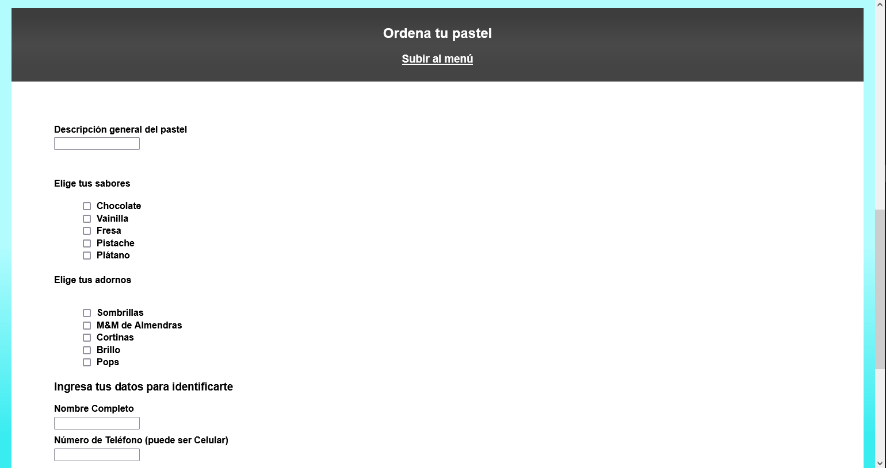

## LaunchX HTML Exercise

This exercise was about working with HTML elements, and designing a logo.
Credit to [Canva](https://www.canva.com/) for letting me use the free-tier of their tool to make the logo.
The CSS was a bonus part of the exercise.

Images from the website:

